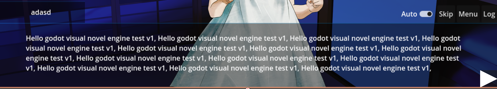
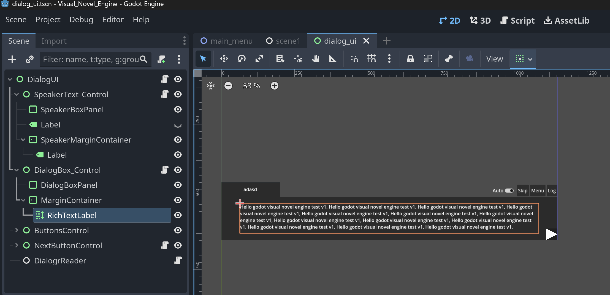

# Devlog #1: Visual Novel in Godot – Dialog System with JSON (Part 1)

Hi, and welcome to my Making Visual Novel with Godot devlog!
In this post, I’ll explain how I designed my dialog system using JSON.
This will be the first in a series of posts covering different aspects of the system.
In this part, I’ll discuss why I chose JSON and how I implemented it in Godot with simple example.

Let's take a look at how our final result will look in the end.


In this post I will only focus how to read from Json in Godot and how to fill our Speaker Name and Dialog Box. In later we will dive in to more detailed stuffs like automatically adding next text.

As you can see we have a Main Menu and game scene.
This is just an example scene and for now let's just focus on dialog box and speaker box.

In engine view it looks like this and we make changes on this are when game starts.




## Dialog System with JSON
Now let's start with Json file and how to read it in Godot Engine.

In my Visual Novel I want to get dialogs from a Json file for every scene.
And each dialog has it's own id, speaker, animations, events, choices (if there is any), and next dialog id for jumping one dialog to another one.

So put it simply I want something like this:

```json
{
    "dialogs": [
        {
            "id": 0,
            "time_stamp": "02.22.2025",
            "speaker": "Woman1",
            "expression_sprite": "woman1_smile",
            "animation": "woman1_talk",
            "before_dialog_event": [
                {
                    "change_bg": "bg1"
                }
            ],
            "after_dialog_event": [
                {
                    "change_music": "bgm1"
                }
            ],
            "dialog": "Hello, [b]Godot[/b] [shake][color=#fcba03]Visual Novel Engine[/color][/shake] test v1.\nHello, [b]Godot[/b] [color=#FF0000]Visual[/color] Novel Engine test v1.",
            "choice_title": null,
            "choices": [],
            "next_dialog_id": 1
        }
    ]
}
```

My plan is quite simple. I just get the dialogs and iterate through them with indexes.

- **dialog**: Is an array that stores all dialogs for that specific scene.

- **id**: Id is needed because we want to jump from dialog to dialog with this index not only array index. For now it is useless but later we will use this as a map key.

- **speaker**: I will get speaker name from this field 

- **expression_sprite**: We can change sprites with expression_sprite.

- **animation**: For setting current animation.

- **dialog**: As you can see our dialog is a little bit different. Not just a normal text and it has some tags in it. Also in Godot we can use BBCode to format our texts. We use tags to make color changes, shakes in our text. In our gif from the top of the post you can see colored, shaking and bold texts.

- **before_dialog_event and after_dialog_event**: Is an array for making changes on the current scene.
I can make changes on background, BGM, animations and more.

- **choice_title**: If there is a choice we can put a choice title.

- **choices**: It is an arrays that stores objects in it. Like {"text": "When?", ...}

- **next_dialog_id**:Next dialog id is crucial because I want to jump other texts according to choices.


I think it is quite simple and we can do a lot of things with this.
I'm happy with this many features for the time being.

## Using Our JSON In GODOT Engine
In this post we get our speaker name and dialog from Json file and put it in our dialog box.

My Dialog Box UI node structure is like this for this scene:



My plan is very straight forward:

1. Read Json file in GDScript
2. Set speaker box and dialog box texts.

### Read Json in GDScript
I used this code to read data from Json.

```
extends Node

class_name DialogReader

func get_dialogs(file_path):
	var file = FileAccess.open(file_path, FileAccess.READ)
	
	if file:
		var json_string = file.get_as_text()
		file.close()
		
		var json_parser = JSON.new()
		var error_code = json_parser.parse(json_string)

		if error_code != OK:
			printerr("Error parsing JSON at line 0: ", json_parser.get_error_message())
			return null
		else:
			print("JSON parsed successfully.")
			var dialogs = json_parser.get_data()["dialogs"]
			return dialogs
	else:
		printerr("Error: Could not open the file. Please check the file path.")

	return null

```

> GDScript's JSON.parse() automatically converts JSON data types to their GDScript equivalents:

- JSON Object {}: Becomes a GDScript Dictionary.
- JSON Array []: Becomes a GDScript Array.
- JSON String "": Becomes a GDScript String.
- JSON Number: Becomes a GDScript int or float (depending on whether it's an integer or a decimal number).
- JSON Boolean true or false: Becomes a GDScript bool.
- JSON Null null: Becomes a GDScript null.

And in other script I call this function to read Json and get the data.
For now ignore the putting text after finishing one dialog. I used create timer for automatically put text functionality. But in this example I will skip that part.

```
extends Node

class_name DialogLoop

@export var db_controller: DialogBoxController
@export var sb_controller: SpeakerBoxController
@export var dialog_reader: DialogReader

var Dialogs
var Dialog_Index = 0

func _ready():
	Dialogs = dialog_reader.get_dialogs("res://dialog/scene1/dialog1.json")
	if Dialogs == null:
		printerr("dialogs not found")
		return
	
	put_dialog()

```

I have *DialogBoxController* and *SpeakerBoxController* classes and they are responsible for getting text label and putting string in it.

We have a global Dialogs array and Dialog Index for iterating that array. 

**_ready function**: Called when the node is "ready", i.e. when both the node and its children have entered the scene tree. If the node has children, their _ready() callbacks get triggered first, and the parent node will receive the ready notification afterwards.

Let's write our *put_dialog* function.
It is very simple function it gets a dialog with current index. For this example I did not use next id but it will change later.
```
func put_dialog():
	var dialog = get_dialog()
	if dialog == null:
		return

	set_dialog_and_speaker(dialog)
```

In *get_dialog* function is responsible for the current dialog.
```
func get_dialog():
	if Dialogs.size() > Dialog_Index:
		var index = Dialog_Index
		Dialog_Index += 1
		return Dialogs[index]
	else:
		return null
```

*set_dialog_and_speaker* function just calls responsible classes to do the job.
```
func set_dialog_and_speaker(current_dialog):
	set_sb(current_dialog)
	await set_db(current_dialog)

func set_sb(current_dialog):
	sb_controller.update_speaker_box(current_dialog.speaker)

func set_db(current_dialog):
	await db_controller.update_dialog_box(current_dialog.dialog)
```

The Dialog Box controllers *db_controller.update_dialog_box* function creates a timer and puts chars to the label with some delay. So we must wait for it to finish the process before doing anything else.

If you want to look the whole project you can look this Github repo:

[Visual Novel With Godot Engine](https://github.com/kaanakgundogdu/GodotVisualNovel)


Thank you for reading my first devlog. I hope you enjoyed.

Here are my links if you want to connect or follow:

>- <a href="https://github.com/kaanakgundogdu" target="_blank">Github</a>
>- <a href="https://www.linkedin.com/in/kaanakgundogdu/" target="_blank">LinkedIn</a>
