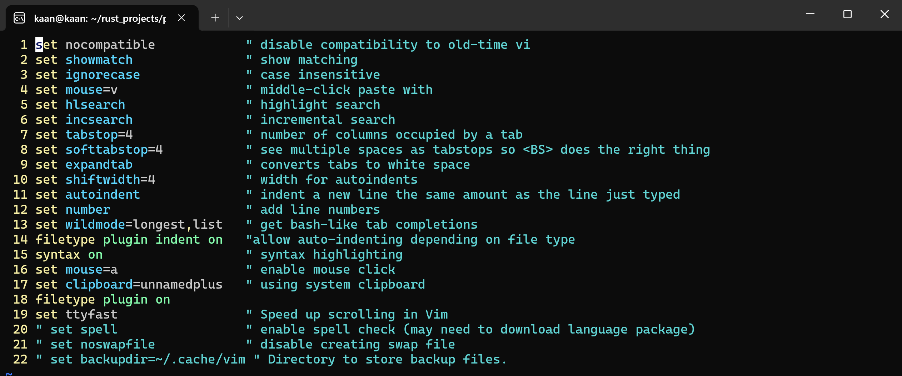

# Neovim ve Eklentilerinin Kurulumu

Merhabalar bu paylaşımda Neovim kurulumundan bahsedeceğim. Neovim ve Vim hakkında ayrı bir paylaşım olabilir bu yüzden Neovim ve Vim'den ayrıntılı bir şekilde bahsetmeyeceğim.


Bu paylaşımda ubuntu 22.04.3 LTS kullanarak kurulumları yapacağım. WSL'de Ubuntu kullanımını hakkında bilgi almak için şu sayfayı ziyaret edebilirsiniz:
[How to install Linux on Windows with WSL
](https://learn.microsoft.com/en-us/windows/wsl/install)


Eğer farklı bir işletim sistemi kullanıyorsanız Neovim'i kendi OS'inize kurmak için şurayı ziyaret edebilirsiniz. 
[Neovim Install](https://github.com/neovim/neovim/blob/master/INSTALL.md)

## Neovim İndir
```
sudo apt install neovim
sudo apt install python3-neovim
sudo apt-get install software-properties-common
sudo apt-get install python-software-properties
sudo add-apt-repository ppa:neovim-ppa/stable
sudo apt-get update
sudo apt-get install neovim
sudo apt-get install python-dev python-pip python3-dev python3-pip
```

Eğer Neovim'i kaldırmak isterseniz şu komutu koşun.
```
sudo apt remove neovim
```

If you're using an older version Ubuntu follow the official document.

Şimdi Neovim'i kullanabilirsiniz:
Blog projemde src klasörü ve altında da SUMMAR.md dosyası var onu nvim komutuyla açabilirim.

```
nvim src/SUMMARY.md
```


Şimdi vim'den çok da farklı durmuyor. Biraz daha güzelleştirmek için config tarafında güncelleme yapalım.

## Basit Neovim Konfigürasyonu
Neovim konfigürasyonu için nvim/init.vim dosyasını güncellememiz lazım. Eğer home klasörünüzdeki config klasöründe nvim dosyası yoksa şu komutu koşup oluşturun: `mkdir ~/.config/nvim`

Şimdi nvim ile init.vim'i açalım.
 `nvim ~/.config/nvim/init.vim`
İçi boş olan dosyamızı şu komutlardan istediklerinizle doldurun:
```
set nocompatible            " disable compatibility to old-time vi
set showmatch               " show matching 
set ignorecase              " case insensitive 
set mouse=v                 " middle-click paste with 
set hlsearch                " highlight search 
set incsearch               " incremental search
set tabstop=4               " number of columns occupied by a tab 
set softtabstop=4           " see multiple spaces as tabstops so <BS> does the right thing
set expandtab               " converts tabs to white space
set shiftwidth=4            " width for autoindents
set autoindent              " indent a new line the same amount as the line just typed
set number                  " add line numbers
set wildmode=longest,list   " get bash-like tab completions
set cc=80                  " set an 80 column border for good coding style
filetype plugin indent on   "allow auto-indenting depending on file type
syntax on                   " syntax highlighting
set mouse=a                 " enable mouse click
set clipboard=unnamedplus   " using system clipboard
filetype plugin on
set cursorline              " highlight current cursorline
set ttyfast                 " Speed up scrolling in Vim
" set spell                 " enable spell check (may need to download language package)
" set noswapfile            " disable creating swap file
" set backupdir=~/.cache/vim " Directory to store backup files.
```

Şöyle çirkin bir konfigürasyo elde ettik.


Ben bu konfigürasyonda `set cursorline ve set cc=80`'yi kaldırdım. Son hal şöyle:


## Neovim ve Vim Yeni Versiyona Geçme
Halihazırda güncel bir vim ve neovim kullanıyorsanız atlayabilirsiniz. Benim yaptığım versiyon güncellemelerin aynısını yapmak zorunda değilsiniz dilediğiniz versiyonu kurabilirsiniz.
`Not: Plugin kurulumu esnasında versiyonla alakalı hatalar almak istemiyorsanız bu adımları yapın.`

##### Vim update
```
sudo add-apt-repository ppa:jonathonf/vim
sudo apt update
sudo apt install vim
```

##### Neovim update
```
sudo add-apt-repository ppa:neovim-ppa/unstable
sudo apt update
sudo apt-get install neovim
```

## Plugin Kurulumu
Ben status info adında bir plugin eklemek istiyorum. Şu satırları init.vim dosyasının en altına ekleyin:

`Not: Plugin kurulumu esnasında versiyonla alakalı hatalar alacaksınız ve bu hataları almak istemiyorsanız öncesinde yukarıdaki güncelleme kısmını atlamyın lütfen.`

```
call plug#begin('~/.local/share/nvim/site/plugged')
Plug 'https://github.com/vim-airline/vim-airline' " Status bar
call plug#end()
```
Sayfayı kaydedip şu komutu koşun: Komut koşmak için escape ile normal moda geçip  `:` ya basın ve `PlugInstall` komutunu koşun:


Ben daha önce indirdiğim için sizinkinden farklı bir çıktı görünebilir:


Sonrasında `:q` ile çıkış yapabilirsiniz.

Eklediğimiz plugin'in ardında görünüm şöyle:


Tüm konfigürasyon dosyası şu şekildedir:
```
set nocompatible            " disable compatibility to old-time vi
set showmatch               " show matching 
set ignorecase              " case insensitive 
set mouse=v                 " middle-click paste with 
set hlsearch                " highlight search 
set incsearch               " incremental search
set tabstop=4               " number of columns occupied by a tab 
set softtabstop=4           " see multiple spaces as tabstops so <BS> does the right thing
set expandtab               " converts tabs to white space
set shiftwidth=4            " width for autoindents
set autoindent              " indent a new line the same amount as the line just typed
set number                  " add line numbers
set wildmode=longest,list   " get bash-like tab completions
filetype plugin indent on   "allow auto-indenting depending on file type
syntax on                   " syntax highlighting
set mouse=a                 " enable mouse click
set clipboard=unnamedplus   " using system clipboard
filetype plugin on
set ttyfast                 " Speed up scrolling in Vim
" set spell                 " enable spell check (may need to download language package)
" set noswapfile            " disable creating swap file
" set backupdir=~/.cache/vim " Directory to store backup files.


call plug#begin('~/.local/share/nvim/site/plugged')
Plug 'https://github.com/vim-airline/vim-airline' " Status bar
call plug#end()
```


Eğer daha farklı pluginler denemek isterseniz NerdTree'yi öneririm burada nasıl indirleceğini anlatmayacağım kendiniz bulabilirsiniz.

`:NERDTree` komutunu koşunca şöyle bir terminal karşınıza çıkacak:


Gördüğünüz üzere neovim oldukça güçlü ve kullanması keyifli bir editör.
İlerleyen zamanlarda daha da ayrıntılara girmek isterim. Hatta NvChad için bile bir yazı planlıyorum.

## Kaynaklar:
- [Neovim](https://neovim.io/)
- [Neovim INSTALL](https://github.com/neovim/neovim/blob/master/INSTALL.md)
- [Neovim-configuration](https://builtin.com/software-engineering-perspectives/neovim-configuration)
- [NeuralNine config-files](https://github.com/NeuralNine/config-files/blob/master/init.vim)
- [Nerdtree](https://github.com/preservim/nerdtree)
- [Install-plugins-in-neovim](https://linuxopsys.com/install-plugins-in-neovim)
- [Neovim-ppa](https://launchpad.net/~neovim-ppa/+archive/ubuntu/unstable)
- [Upgrading_to_vim_version_9](https://www.reddit.com/r/vim/comments/173qr27/difficulty_upgrading_to_vim_version_9_on_ubuntu/)
