# NvChad Nedir
NvChad estetik bir kullanıcı arayüzü ve ayağa kalkma süresi çok kısa olan (kendileri bu hıza "blazing fast" diyorlar) lua programlama dili ile yazılmıs bir neovim konfigürasyonudur.
Estetik bir kullanıcı arayüzü deneyimi sağlamak için teleskop, nvim-tree vb. gibi kullanıcı arayüzü eklentileri de kolayca yüklenebiliyor hatta bazıları varsayılan olarak geliyor.
### Ön gereksinimler
Bu paylaşımda da geçen paylaşımda olduğu gibi ubuntu 22.04.3 LTS kullanarak kurulumları yapacağım.

- Neovim 0.10.
- [Nerd Font](https://www.nerdfonts.com/) terminal fontu olarak kullanılacak.
    - Fontun Mono ile bitmediğine emin olun.
    - Örnek : JetbrainsMono Nerd Font olması gerekiyor ~~JetbrainsMono Nerd Font Mono~~ değil.
- [Ripgrep](https://github.com/BurntSushi/ripgrep) Telescope'da grep ile arama yapmak için gerekli (Opsiyonel).
- GCC.
- Eski neovim dosyalarının kaldırılmış olması gerekli. Aşağıdaki komutlarda koşarken yapacağız bunu.
### Ripgrep Kurulumu

```
$ curl -LO https://github.com/BurntSushi/ripgrep/releases/download/14.1.0/ripgrep_14.1.0-1_amd64.deb
$ sudo dpkg -i ripgrep_14.1.0-1_amd64.deb
```

Ya da
```
$ sudo apt-get install ripgrep
```
Ripgrep kullanımı ve komutları görmek için şunu koşun: `rg -help`
### Eski NeoVim konfigürasyonlarını kaldırmak
Linux tarafında bu komutları koşabilirsiniz:
``` 
rm -rf ~/.config/nvim
rm -rf ~/.local/state/nvim
rm -rf ~/.local/share/nvim
```
### Font kurulumu 
Ben windows terminal kullanıyorum ve fontları indirdikten sonra hepsini seçip sağ tıkladıktan sonra yükemeyi seçtim.

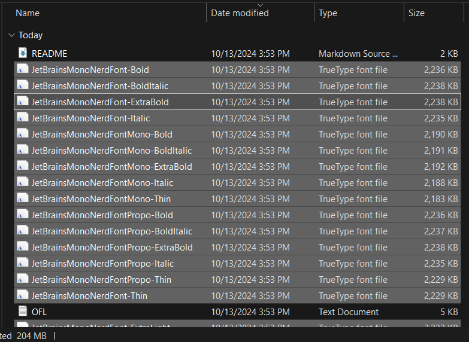

Sonrasında terminalin ayarlarından font seçimini yaptım.

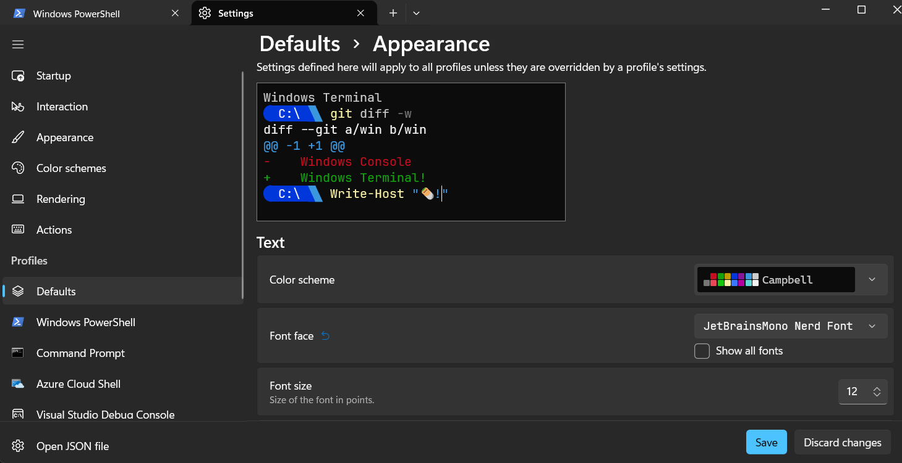

### NvChad Yükle
```
git clone https://github.com/NvChad/starter ~/.config/nvim && nvim
```

Yükleme bittikten sonra karşınızda şöyle bir ekran çıkacak.
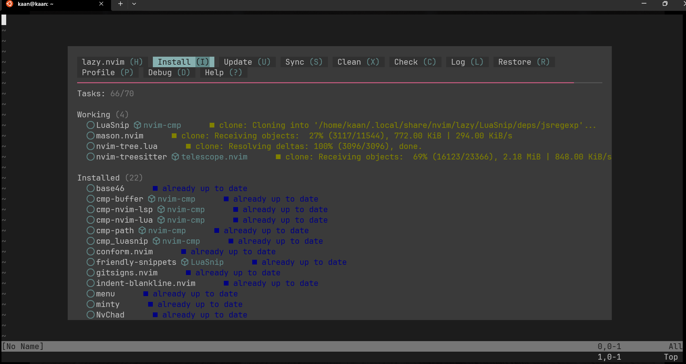

Sonrasında şu komutu koşun:
```
:MasonInstallAll
```
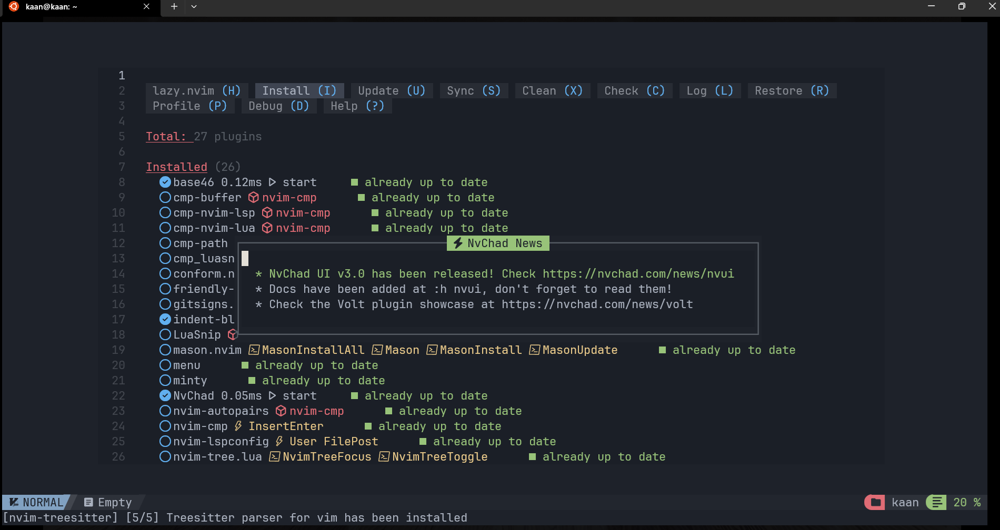

Ayrıca neovim dosyasının içindeki `.git` dosyasını silmeyi unutmayın.
### Tema Ayarlama
Tema seçme arayüzünü açmak için ```space + t + h``` tuşlarına sırasıyla basın.
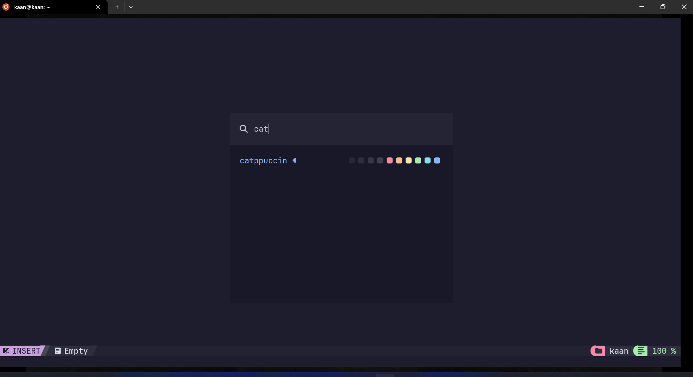

```ctrl n``` veya ```ctrl p``` ile temalar arasında tek tek gezebilirsiniz.
Ya da tema ismini aratabilirsiniz. Ben `catppuccin` olarak ayarladım.
### TreeSitter
Nvim-treesitter ile Neovim'deki tree-sitter arayüzünü kullanmak basit ve kolay.
Ben şu sıralar kullandığım dilleri referans alıp şu komutları koştum:

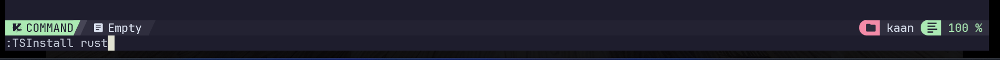

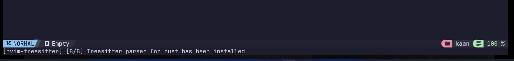

```
TSInstall rust
TSInstall markdown
TSInstall typescript
TSInstallInfo
```
### NVimTree
NVimTree, Neovim için yapılmış bir dosya gezgini ve lua programlama dilinde 
yazılmıştır.

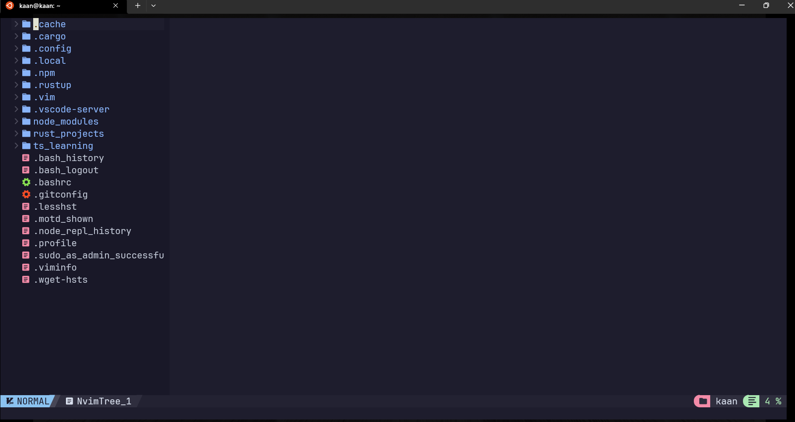

Bazı kısayollar şöyle:
- `ctrl + n` nvtree'yi açar/kapatır
- `enter` dosya açar
- `space + e` nvtree'ye döner
- `a` (create) dosya oluşturur
- `c` (copy) kopyalar
- `p` (paste) yapıştırır
- `r` (rename) yeniden adlandırır
- `d` (delete) siler
- `m` (mark) işaretler

Kısayolları görmek için: `g + ?` nvimtree'deki tuş atamalarını gösterir.

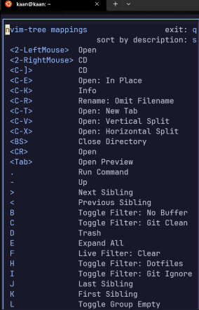

#### Dosyalar arasinda gezinme
- `space + f + f` arama yapmak için telescope'u açar
- `space + f + b` yalnızca açık pencerelerde arama yapar

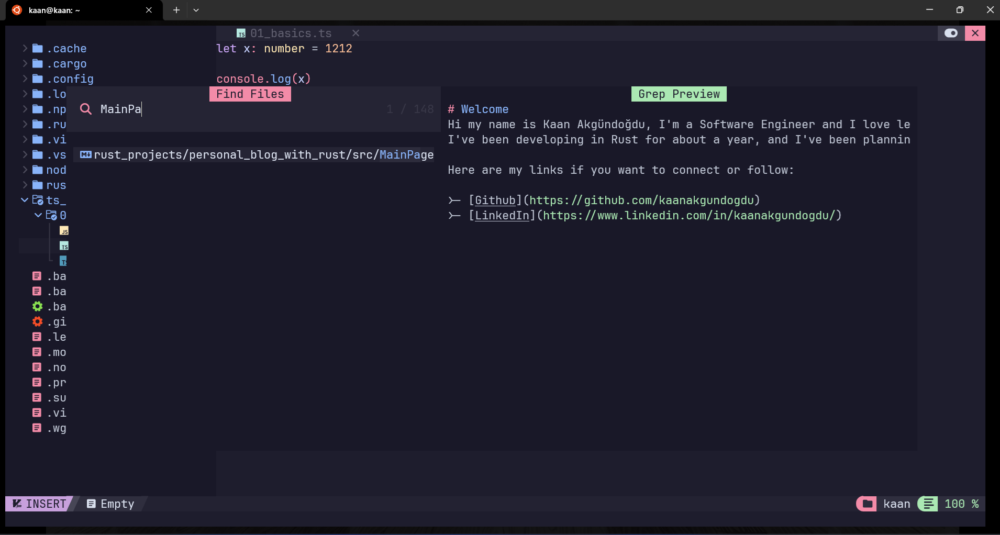

- `space + f` basıp beklerseniz diğer seçenekleri de görebilirsiniz:

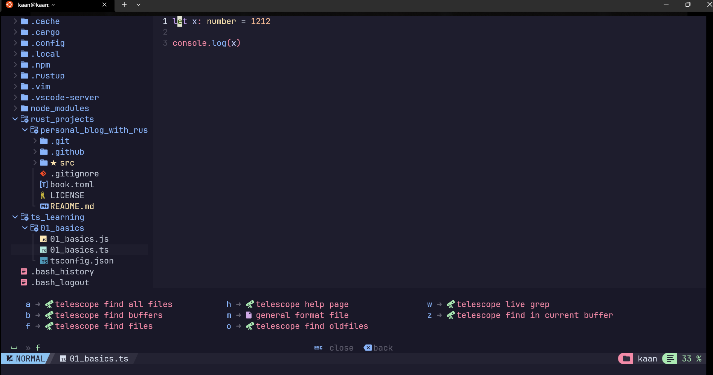

- `space + f + w` grep ile arama yapar

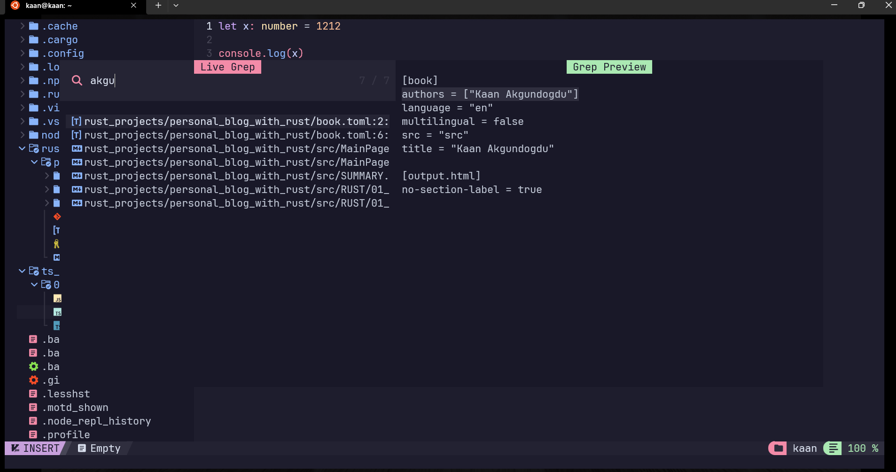

### Kısayollar
`space + c + h` cheatsheet'i açmak için kullanabilirsiniz.

Eger `space` tuşuna basıp belli bir süre beklerseniz, altta önerileri görebilirsiniz.

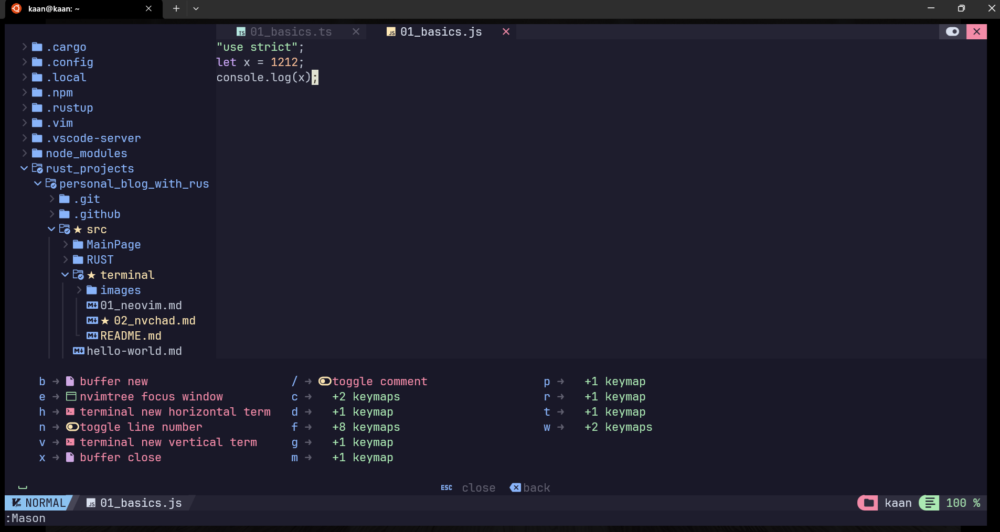


- `space + n` : satır numarası açma/kapama
- `space + r + n` : bağıl satır numarası açma/kapama (relative line numbers) 
- `tab` : açık penceler arasinda dolaşma
- `shift tab` : ters istikamette dolaşma
- `space + x` : aktif pencereyi kapatır
- `space + h` ya da `space + v` yatay veya dikey olarak terminal açar.
- `alt + i` : yeni bir terminal penceresi açar.
### Nvim Package Manager Mason
`:Mason` yazinca çıkan arayüzde indirdiklerim şöyle:

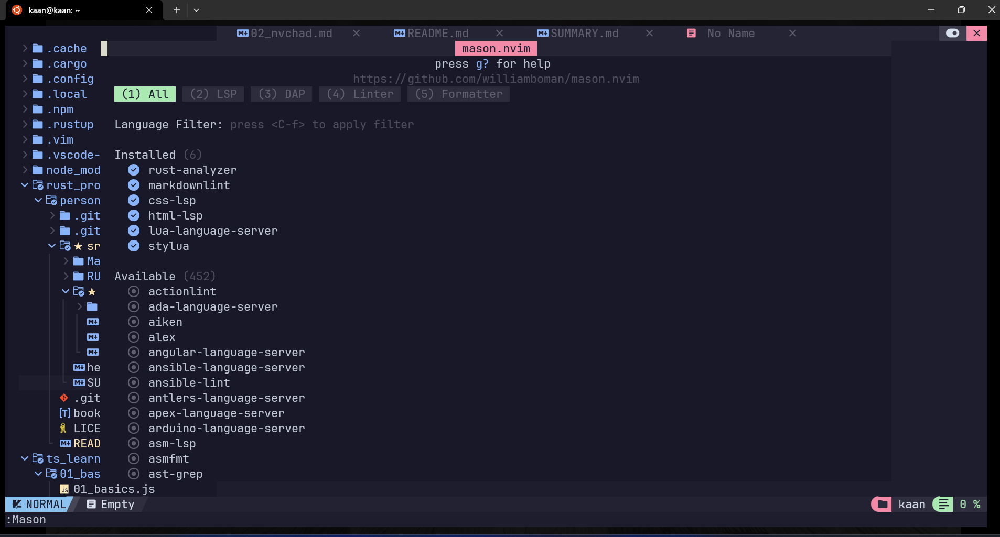

### Not:
Eğer siz de arama yaparken text bulunamadı gibi bir hatayla karşılaşırsanız Telescope konfigürasyonundan treesitter'ı çıkarabilirsiniz. 
Ben şu satırları .config/nvim/init.lua'ya ekledim:
```
require('telescope').setup {
    defaults = {
        -- other configurations...
        preview = {
            treesitter = false, -- Disable Tree-sitter for preview
        },
        -- Other settings can go here...
    },
}
```
# Kaynaklar
- [nvchad](https://nvchad.com/docs/quickstart/install)
- [ripgrep](https://github.com/BurntSushi/ripgrep#installation)
- [nvim-treesitter](https://github.com/nvim-treesitter/nvim-treesitter)
- [nerdfonts](https://www.nerdfonts.com/font-downloads)
- [nvim-telescope](https://github.com/nvim-telescope/telescope.nvim)