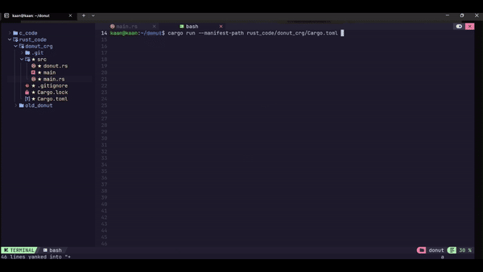

# Donut Animation In Terminal With Rust and C
Last week, while browsing the internet, I came across a 3D animated donut running in a terminal, and I was incredibly impressed by it.

I started researching how to create it and found the original blog post, which provided a detailed explanation and pseudocode. Some of the code I found online either didn't work properly or was only designed to run on Windows. So, I began writing my own version, first in C and then in Rust. I hope you like it!

Original blog post is here: 
[Donut math: how donut.c works](https://www.a1k0n.net/2011/07/20/donut-math.html)

This is what it looks like:



## Rust Code
In the Rust code, I added error handling and used several shorter functions to make the code clearer.
If you use cargo you can run with `cargo run` or you can use `rustc donut.rs` and run with `./donut` command.

`donut.rs or main.rs`
```
use std::f32::consts::PI;
use std::io::{self, Write};
use std::{error, thread, time};

const THETA_SPACING: f32 = 0.07;
const PI_SPACING: f32 = 0.02;

const R1: f32 = 0.7;
const R2: f32 = 1.0;
const K2: f32 = 5.0;

const SCREEN_WIDTH: f32 = 80.0;
const SCREEN_HEIGHT: f32 = 30.0;

const K1: f32 = SCREEN_WIDTH * K2 * 2.0 / (16.0 * (R1 + R2));

fn render_frame(a: f32, b: f32) -> std::result::Result<(), Box<dyn error::Error>> {
    let cos_a: f32 = a.cos();
    let sin_a: f32 = a.sin();
    let cos_b: f32 = b.cos();
    let sin_b: f32 = b.sin();

    const H: usize = SCREEN_HEIGHT as usize;
    const W: usize = SCREEN_WIDTH as usize;
    let mut output: [[char; W]; H] = [[' '; W]; H];
    let mut z_buffer: [[f32; W]; H] = [[0.0; W]; H];

    let mut theta: f32 = 0.0;
    while theta < 2.0 * PI {
        let cos_theta: f32 = theta.cos();
        let sin_theta: f32 = theta.sin();

        let mut fake_pi: f32 = 0.0;
        while fake_pi < 2.0 * PI {
            let cos_pi: f32 = fake_pi.cos();
            let sin_pi: f32 = fake_pi.sin();

            let circle_x: f32 = R2 + R1 * cos_theta;
            let circle_y: f32 = R1 * sin_theta;

            let x: f32 =
                circle_x * (cos_b * cos_pi + sin_a * sin_b * sin_pi) - circle_y * cos_a * sin_b;
            let y: f32 =
                circle_x * (sin_b * cos_pi - sin_a * cos_b * sin_pi) + circle_y * cos_a * cos_b;
            let z: f32 = K2 + cos_a * circle_x * sin_pi + circle_y * sin_a;
            let ooz: f32 = 1.0 / z;

            let xp: usize = (SCREEN_WIDTH / 2.0 + K1 * ooz * x) as usize;
            let yp: usize = (SCREEN_HEIGHT / 2.0 - K1 * ooz * y) as usize;

            let luminance: f32 =
                cos_pi * cos_theta * sin_b - cos_a * cos_theta * sin_pi - sin_a * sin_theta
                    + cos_b * (cos_a * sin_theta - cos_theta * sin_a * sin_pi);

            if luminance > 0.0 && xp < W && yp < H && ooz > z_buffer[yp][xp] {
                z_buffer[yp][xp] = ooz;
                let luminance_index: usize = (luminance * 8.0).clamp(0.0, 11.0) as usize;
                output[yp][xp] = ".,-~:;=!*#$@"[luminance_index..luminance_index + 1]
                    .chars()
                    .next()
                    .ok_or("Getting char failed")?;
            }

            fake_pi += PI_SPACING;
        }

        theta += THETA_SPACING;
    }

    print!("\x1b[2J\x1b[H");
    for row in output.iter().take(H) {
        print!("{}", row.iter().collect::<String>());
        println!();
    }

    io::stdout().flush()?;

    Ok(())
}

fn main() {
    let mut a: f32 = 0.0;
    let mut b: f32 = 0.0;

    loop {
        match render_frame(a, b) {
            Ok(_) => (),
            Err(e) => println!("Error occured while rendering error: {:?}", e),
        }
        let sleep_dur: time::Duration = time::Duration::from_millis(100);
        thread::sleep(sleep_dur);
        a += 0.08;
        b += 0.04;
    }
}
```
## C Code
C code is very similar to pseudocode you can compile and run like this:
`gcc donut.c -lm` and run with `./a.out`

`donut.c`
```
#include <stdio.h>
#include <math.h>
#include <unistd.h>
#include <stdlib.h>

const char characters[] = ".,-~:;=!*#$@";
const char characters2[] = "kaan.,-~:;=!*#$@";

const double theta_spacing = 0.07;
const double pi_spacing = 0.02;

const double R1 = .5;
const double R2 = 1;
const double K2 = 5;

const int screen_width = 80;
const int screen_height = 24;

const double K1 = screen_width * K2 * 2 / (16 * (R1 + R2));

void render_frame(double A, double B) {
  double cosA = cos(A);
  double sinA = sin(A);

  double cosB = cos(B);
  double sinB = sin(B);

  char output[screen_height][screen_width];
  float zBuffer[screen_height][screen_width];

  for (int idx = 0; idx < screen_height; idx++) {
    for (int jdx = 0; jdx < screen_width; jdx++) {
      output[idx][jdx] = ' ';
      zBuffer[idx][jdx] = 0.0f;
    }
  }

  for (double theta = 0; theta < 2 * M_PI; theta += theta_spacing) {
    double costheta = cos(theta);
    double sintheta = sin(theta);

    for (double pi_custom = 0; pi_custom < 2 * M_PI; pi_custom += pi_spacing) {
      double cosPI = cos(pi_custom);
      double sinPI = sin(pi_custom);

      double circleX = R2 + R1 * costheta;
      double circleY = R1 * sintheta;

      double x = circleX * (cosB * cosPI + sinA * sinB * sinPI) - circleY * cosA * sinB;
      double y = circleX * (sinB * cosPI - sinA * cosB * sinPI) + circleY * cosA * cosB;

      double z = K2 + cosA * circleX * sinPI + circleY * sinA;
      double one_over_z = 1 / z;

      int xp = (int) (screen_width / 2 + K1 * one_over_z * x);
      int yp = (int) (screen_height / 2 - K1 * one_over_z * y);

      if (xp >= 0 && xp < screen_width && yp >= 0 && yp < screen_height) {
        float L = cosPI * costheta * sinB - cosA * costheta * sinPI - sinA * sintheta +
          cosB * (cosA * sintheta - costheta * sinA * sinPI);

        if (L > 0) {
          if (one_over_z > zBuffer[yp][xp]) {
            zBuffer[yp][xp] = one_over_z;
            int luminance_index = (int)(L * 8);
            if (luminance_index >= 0 && luminance_index < 16) {
              output[yp][xp] = characters2[luminance_index];
            }
          }
        }
      }
    }
  }

  printf("\x1b[2J");
  printf("\x1b[3;H");
  for (int j = 0; j < screen_height; j++) {
    for (int i = 0; i < screen_width; i++) {
      putchar(output[j][i]);
    }
    putchar('\n');
  }

}

int main() {
  double A = 0.0;
  double B = 0.0;
  while (1) {
    render_frame(A, B);
    A += 0.04;
    B += 0.02;
    usleep(50000);
  }

  return 0;
}

```

Also you can make changes in global variables or some hard coded numbers as you like.